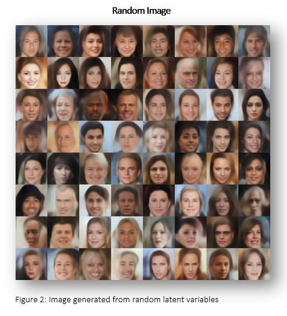
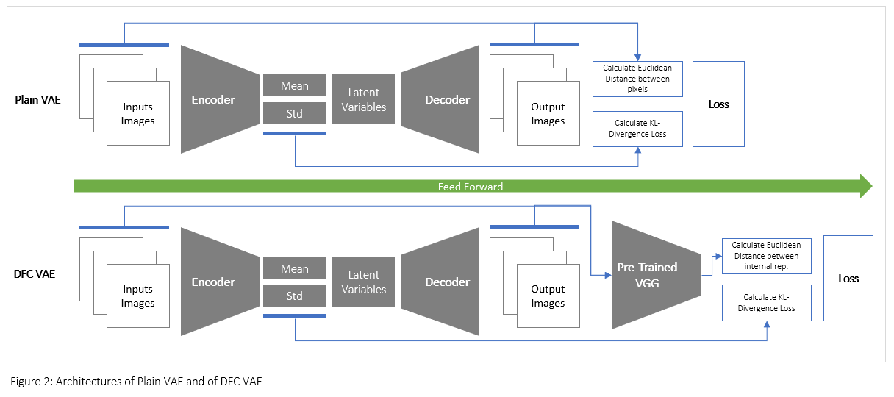

# Deep Feature Consistent Variational Autoencoder in Tensorflow

This repository has an objective to implement Deep Feature Consisten Variational Autoencoder (DFC-VAE) according to [Deep Feature Consistent Variational Autoencoder](https://arxiv.org/abs/1610.00291).
Tensorflow and Python3 are used for development, and pre-trained VGG16 is adapted from [VGG in TensorFlow](https://www.cs.toronto.edu/~frossard/post/vgg16/). The training data is [CelebA dataset](http://mmlab.ie.cuhk.edu.hk/projects/CelebA.html).

To understand this following note, I would recommend to know the concept of Variational Autoencoder and generative model.

## Results

Figure 3: Interpolated image

## Problem Statement

It is known that one major problem of plain Variational Autoencoder (Plain-VAE) is that images generated by the model are blurry. 
This is because the plain model's loss function is defined by pixel-wise comparison between input images and generated images. 
As a consequence, optimizing model to achieve a great performance is difficult because slightly shifting or distorting those images can result in a very high loss. In other words, even the images have just slight difference in human eyes, computer treats that a big difference!

However, with DFC-VAE, the model leverages perceptual loss used in [Neural Style Transfer](https://github.com/sbavon/Neural-Style-Transfer-in-Tensorflow).
With regard to [this paper](https://arxiv.org/abs/1508.06576), internal representations of convolutional neural networks could capture a content of the input image. This finding leads to the concept of perceptual loss, which compares the content - hidden representation - between images as oppose to calculate euclidean distant among pixels. 

## Implementation

The solution contains four files

| File Name  | Description |
| ------------- | ------------- |
| dfc_vae_model.py  | builds the VAE model, including encoder,decoder, VGG, loss function, and optimizer  |
| train_dfc_vae.py  | trains the DFC_VAE model, and tests interpolation  |
| vgg16.py  | builds the pre-trained VGG16 model  |
| util.py  | contains supporting functions, such as data-preprocessing  |

### Step-by-Step execution

#### Download and preprocess data
1. Download pre-trained VGG weights from [VGG in TensorFlow](https://www.cs.toronto.edu/~frossard/post/vgg16/)
2. Download CelebA dataset from [CelebA dataset](http://mmlab.ie.cuhk.edu.hk/projects/CelebA.html)
3. Compress data in Zip
4. Process images (crop and resize) and convert them to TFRecord format (refer to *write_tfrecord()* function in *util.py*)

#### Train the model
4. Run train_dfc_vae.py

## Dependencies
- scipy.misc 
- zipfile (used for reading content inside Zip file)
- imageio (used for generating *.gif* file)

## Tips
- Beta value is extremely significant. You need to adjust the value to make sure the model produce a great result
- Save file in *.png* format for a better quality image

## References
- [Deep Feature Consistent Variational Autoencoder](https://arxiv.org/abs/1610.00291)
- [A Neural Algorithm of Artistic Style](https://arxiv.org/abs/1508.06576)
- [VGG in TensorFlow](https://www.cs.toronto.edu/~frossard/post/vgg16/)

